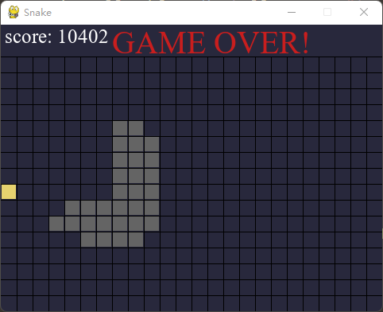

# Snake with AI
游戏环境使用pygame编写，操作支持键盘输入和AI自动决策。强化学习部分采用DQN算法（pytorch实现神经网络），决策算法按接口实现，支持扩展。

## 项目结构
+ src
    + algorithms（实现的所有决策算法）
        + base.py（决策算法的统一接口）
        + dqn.py
    + agent.py（智能体类）
    + food.py（食物类）
    + game.py（游戏类）
    + snake.py（贪吃蛇类）
    + utils.py（通用工具类）
+ config.json（基本配置信息，包括游戏配置和AI配置）

## 使用方法
+ 使用dqn算法自动游玩前请先在config.json中修改参数文件路径
+ agent.py和game.py中有简单的测试代码，直接运行两个文件或者自行封装main.py运行。
+ 键盘游玩键位：方向键或WASD操作贪吃蛇，r重新开始。

## 运行效果
超参数没仔细调，测试结果已经可以看出有一定智能。

